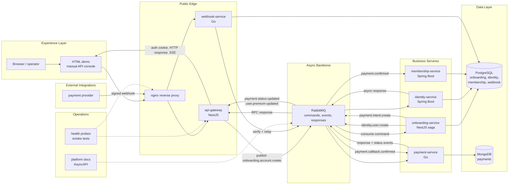

# Modularis

Portuguese: [README.pt-BR.md](./README.pt-BR.md)

Modularis is a polyglot microservice ecosystem used to demonstrate distributed onboarding, payment confirmation, entitlement activation, and operational validation across real service boundaries.

## Overview

- Public edge: NestJS
- Saga orchestration: NestJS + PostgreSQL
- Identity and membership cores: Spring Boot + PostgreSQL
- Payment and webhook edges: Go, MongoDB, PostgreSQL
- Async backbone: RabbitMQ
- Local integration surface: Docker Compose + nginx + HTML demo

## Architecture at a glance



The ecosystem is intentionally split into a thin public edge, an async backbone, and isolated business services. The demo talks to nginx, nginx routes public traffic to the gateway and webhook ingress, and RabbitMQ carries the long-running onboarding and payment coordination behind the HTTP layer.

## Architecture notes

- RabbitMQ keeps HTTP fast and narrow while the onboarding saga, payment transitions, and premium activation run asynchronously across service boundaries.
- Service separation follows ownership: gateway owns public access, onboarding owns orchestration, identity owns users, payment owns payment state, membership owns premium entitlement, and webhook owns signed external ingress.
- The main trade-off is operational complexity: polyglot services and async request/response add more moving parts, but keep responsibilities explicit and easier to evolve independently.
- The platform layer adds health probes, smoke tests, AsyncAPI contracts, and a build-free demo so the whole ecosystem can be validated locally without a separate frontend codebase.

## Quick start

```sh
docker compose up --build -d
```

No wrapper scripts are required. The documented path is direct Docker Compose plus the native toolchains already used by each service.

## Documentation map

- Ecosystem hub: [platform/README.md](./platform/README.md)
- Architecture docs: [platform/docs/architecture/overview.md](./platform/docs/architecture/overview.md)
- Communication and events: [platform/docs/communication/events-and-rabbitmq.md](./platform/docs/communication/events-and-rabbitmq.md)
- Local operations: [platform/docs/operations/local-development.md](./platform/docs/operations/local-development.md)
- Async contract: [platform/contracts/asyncapi/modularis.yaml](./platform/contracts/asyncapi/modularis.yaml)

## Services

- [api-gateway](./api-gateway/README.md)
- [onboarding-service](./onboarding-service/README.md)
- [identity-service](./identity-service/README.md)
- [membership-service](./membership-service/README.md)
- [payment-service](./payment-service/README.md)
- [webhook-service](./webhook-service/README.md)
