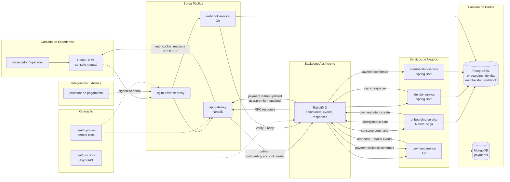

# Modularis

English: [README.md](./README.md)

Modularis é um ecossistema de microsserviços poliglota usado para demonstrar onboarding distribuído, confirmação de pagamento, ativação de entitlement e validação operacional sobre fronteiras reais entre serviços.

## Visão geral

- Borda pública: NestJS
- Orquestração de saga: NestJS + PostgreSQL
- Núcleos de identidade e membership: Spring Boot + PostgreSQL
- Pagamentos e webhook: Go, MongoDB, PostgreSQL
- Backbone assíncrono: RabbitMQ
- Superfície local integrada: Docker Compose + nginx + demo HTML

## Arquitetura em uma imagem



O ecossistema foi separado de forma intencional entre uma borda pública fina, um backbone assíncrono e serviços de negócio isolados. A demo conversa com o nginx, o nginx encaminha o tráfego público para o gateway e para o ingresso de webhook, e o RabbitMQ carrega a coordenação de onboarding e pagamento por trás da camada HTTP.

## Notas de arquitetura

- RabbitMQ mantém o HTTP rápido e fino enquanto a saga de onboarding, as transições de pagamento e a ativação premium acontecem de forma assíncrona entre serviços.
- A separação segue ownership claro: gateway cuida do acesso público, onboarding da orquestração, identity dos usuários, payment do estado de pagamento, membership do entitlement premium e webhook do ingresso externo assinado.
- O principal trade-off é a complexidade operacional: serviços poliglotas e request/response assíncrono adicionam mais partes móveis, mas deixam as responsabilidades explícitas e mais fáceis de evoluir de forma independente.
- A camada `platform` concentra health probes, smoke tests, contratos AsyncAPI e uma demo sem build para validar o ecossistema inteiro localmente sem depender de outro frontend.

## Execução rápida

```sh
docker compose up --build -d
```

Nenhum wrapper de shell é necessário. O caminho documentado usa Docker Compose e as toolchains nativas que cada serviço já exige.

## Mapa da documentação

- Hub do ecossistema: [platform/README.pt-BR.md](./platform/README.pt-BR.md)
- Arquitetura: [platform/docs/architecture/overview.pt-BR.md](./platform/docs/architecture/overview.pt-BR.md)
- Comunicação e eventos: [platform/docs/communication/events-and-rabbitmq.pt-BR.md](./platform/docs/communication/events-and-rabbitmq.pt-BR.md)
- Operação local: [platform/docs/operations/local-development.pt-BR.md](./platform/docs/operations/local-development.pt-BR.md)
- Contrato assíncrono: [platform/contracts/asyncapi/modularis.yaml](./platform/contracts/asyncapi/modularis.yaml)

## Serviços

- [api-gateway](./api-gateway/README.pt-BR.md)
- [onboarding-service](./onboarding-service/README.pt-BR.md)
- [identity-service](./identity-service/README.pt-BR.md)
- [membership-service](./membership-service/README.pt-BR.md)
- [payment-service](./payment-service/README.pt-BR.md)
- [webhook-service](./webhook-service/README.pt-BR.md)
